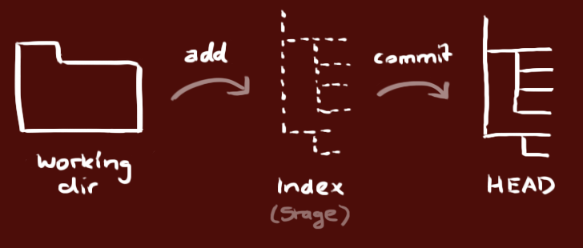

# Let's Get Started

---
@title[Git architecture]

@snap[west span-50]
@ul[spaced text-white]
- Git is a distributed version control system (vs SVN which is centralized)
- Most used => Github, GitLab, Local Git, Bitbucket
@ulend
@snapend

@snap[east span-50]

@snapend

---
@title[Git : CLONE]
### @css[headline](Clone repository)
@snap[west span-50]
### Clone : Get copy about remote repository
@snapend

@snap[east span-50]

@snapend

---
@title[Trees]
### @css[headline](Local Trees)
@snap[west span-50]
@ul[spaced text-white]
- Local repository contains 3 trees
- Working home : Contains source files
- Index : Tempory space
- HEAD : Last validation
@ulend
@snapend

@snap[east span-50]

@snapend

---
@title[Add and Commit]
### @css[headline](Add and Commit)
@ul[spaced text-white]
- Propose a change (add changeset in Index) : git add FILENAME
- Valid changes (file added in HEAD): git commit -m 'Validation message'
@ulend

---
@title[Send changes]
### @css[headline](Send changes)
@ul[spaced text-white]
- Send changes from HEAD to remote repository : git push origin master (git push REMOTE BRANCH)
- You can add new remote : git remote add REMOTE_NAME SERVER
@ulend

---